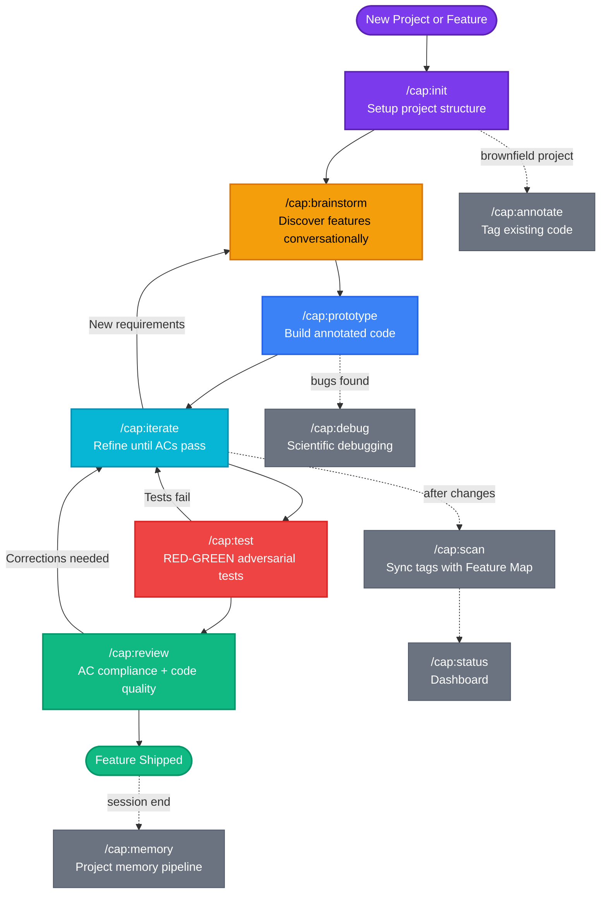
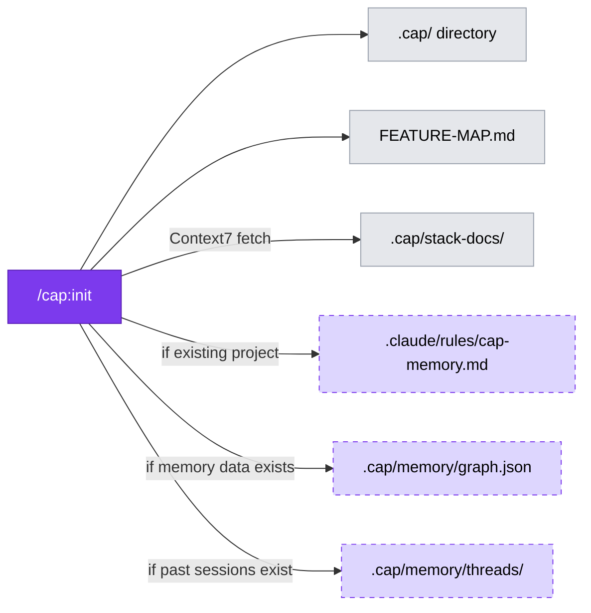
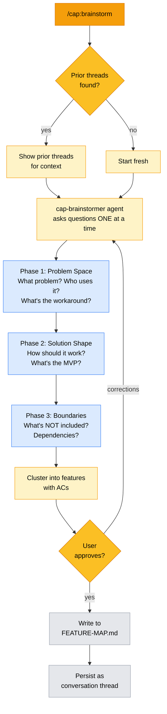
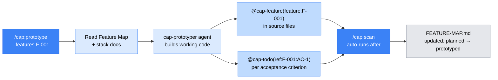
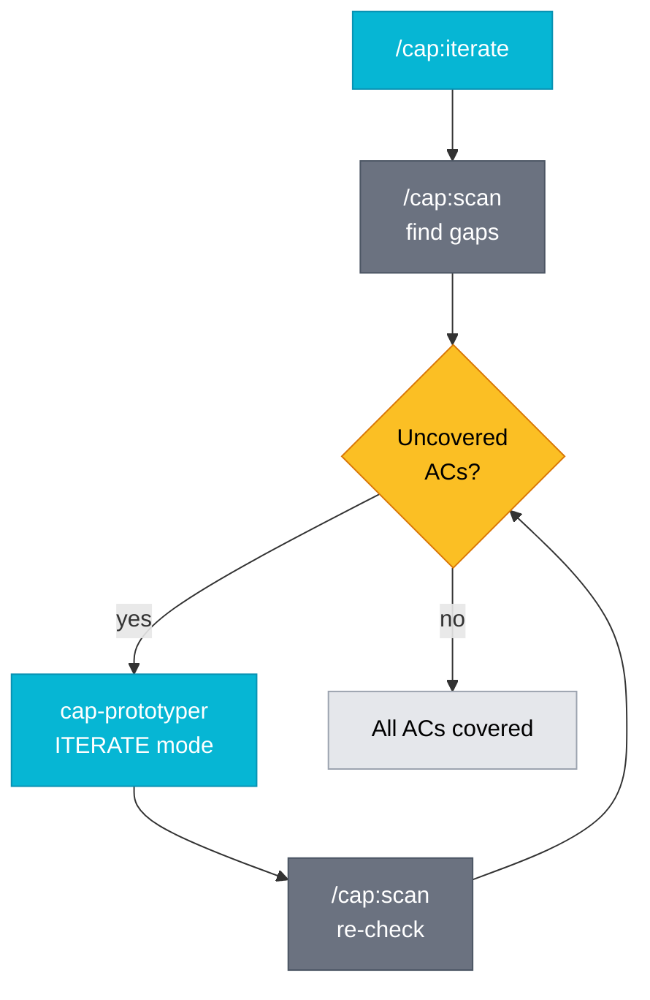
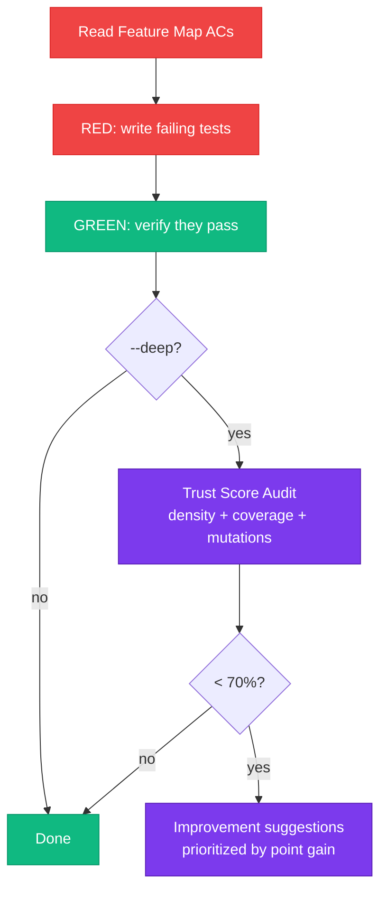
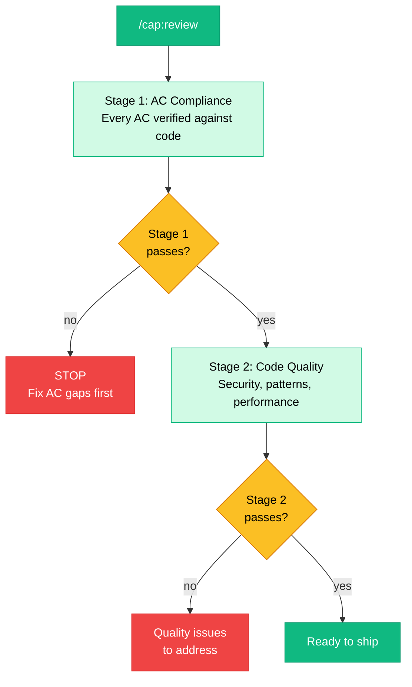
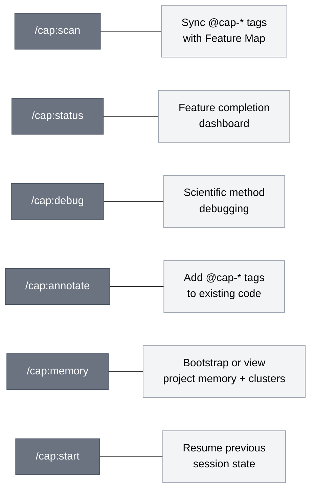

# CAP Workflow Guide

> How to use Code as Plan — from project setup to shipped features.

## The Big Picture



---

## Phase 1: Project Setup

### `/cap:init` — One-time initialization



**When:** Once per project, or when joining an existing project.

**What it does:**
1. Creates `.cap/` directory structure (SESSION.json, stack-docs, debug)
2. Creates `FEATURE-MAP.md` template (only if it doesn't exist)
3. Fetches library documentation via Context7 for all dependencies
4. Detects monorepo structure and creates per-app Feature Maps
5. Performs brownfield analysis on existing codebases
6. Builds memory graph from existing data (if any)
7. Migrates past brainstorm sessions to conversation threads

**Best practice:** Run `/cap:init` even if you've used CAP before — it's idempotent and will pick up new dependencies and build the memory graph.

---

## Phase 2: Feature Discovery

### `/cap:brainstorm` — Conversational feature design



**When:** Starting new work, exploring a feature area, or when requirements are unclear.

**Key behaviors:**
- Agent asks **one question at a time** — not a list
- References existing Feature Map to avoid duplicates
- Checks prior brainstorm threads and asks if you want to continue
- Returns structured Feature Map entries with numbered ACs
- **Nothing is written until you explicitly approve**

**Best practice:**
- Use `--resume` to continue a previous brainstorm thread
- Use `--multi` when the project has multiple independent feature areas
- Run brainstorm even for small features — the ACs become your test contract

---

## Phase 3: Build

### `/cap:prototype` — Code-first development



**When:** After brainstorm, when you have features with ACs in the Feature Map.

**What it does:**
1. Reads Feature Map and selects target features
2. Loads stack docs for library context
3. Builds working, annotated code with `@cap-feature` and `@cap-todo` tags
4. Auto-runs `/cap:scan` to sync tag state back to Feature Map
5. Creates feature branch automatically

**4 modes:**
| Mode | Flag | Use case |
|------|------|----------|
| Prototype | *(default)* | Build new feature from scratch |
| Iterate | `--iterate` | Refine existing prototype |
| Architecture | `--architecture` | Design structure without implementation |
| Annotate | `--annotate` | Tag existing code retroactively |

**Best practice:** Prototype one feature at a time. The tags create a traceable link from requirements (Feature Map) to implementation (code).

---

## Phase 4: Refine

### `/cap:iterate` — Close the gaps



**When:** After initial prototype, to fill in missing acceptance criteria.

**What it does:**
1. Runs `/cap:scan` to find which ACs lack `@cap-todo` coverage
2. Spawns prototyper in ITERATE mode to address gaps
3. Re-scans and repeats until all ACs are satisfied (or you stop)

**Best practice:** Run iterate before testing — it catches missing ACs that would fail in tests.

---

## Phase 5: Test

### `/cap:test` — Adversarial RED-GREEN testing



**When:** After prototype/iterate, when code is ready for verification.

**Flags:**
| Flag | Effect |
|------|--------|
| `--features F-001` | Scope to specific features |
| `--red-only` | Stop after RED phase (TDD workflow) |
| `--deep` | Run test audit after GREEN — trust score < 70% triggers improvement suggestions |

**What it does:**
1. Reads Feature Map ACs for target features
2. **RED phase:** Writes tests that SHOULD fail if the AC isn't implemented
3. **GREEN phase:** Runs tests against actual code, verifies they pass
4. **DEEP mode** (`--deep`): Runs full audit — assertion density, coverage, mutations, anti-patterns
5. Trust score < 70% shows prioritized suggestions with estimated point gains

**Trust score components:** Assertion density (30pts), Coverage (30pts), Mutation score (25pts), Anti-pattern penalty (-15pts), Empty test penalty (-10pts)

**Best practice:** Use `--deep` for important features. The trust score catches weak tests that pass but don't actually verify anything.

---

## Phase 6: Review

### `/cap:review` — Two-stage quality gate



**When:** Before merging, after tests pass.

**Key rule:** Stage 2 only runs if Stage 1 passes. No point reviewing code quality if the feature doesn't meet its acceptance criteria.

---

## Support Commands

### Always available, use anytime



---

## Tag System — The Traceability Link

Tags in your source code are the bridge between the Feature Map and implementation:

```
Source Code                          Feature Map
-----------                          -----------
@cap-feature(feature:F-001)    <-->  F-001: Implement Auth
  @cap-todo(ref:F-001:AC-1)   <-->    AC-1: Login endpoint
  @cap-todo(ref:F-001:AC-2)   <-->    AC-2: JWT tokens
  @cap-todo risk: session...   <-->    (surfaced in pitfalls.md)
  @cap-todo decision: bcrypt   <-->    (surfaced in decisions.md)
```

**Primary tags (mandatory):**
- `@cap-feature(feature:F-NNN)` — marks a file as belonging to a feature
- `@cap-todo(ref:F-NNN:AC-N)` — marks implementation of a specific acceptance criterion

**Subtypes (optional):**
- `@cap-todo risk: ...` — known risk or concern
- `@cap-todo decision: ...` — architectural decision with rationale

---

## Memory System — Cross-Session Intelligence

```mermaid
flowchart TD
    classDef session fill:#7c3aed,color:#fff,stroke:#5b21b6
    classDef hook fill:#ddd6fe,color:#000,stroke:#7c3aed
    classDef memory fill:#e5e7eb,color:#000,stroke:#9ca3af
    classDef graph fill:#fef3c7,color:#000,stroke:#f59e0b
    classDef thread fill:#f59e0b,color:#000,stroke:#d97706

    SESSION["Claude Code Session"]:::session
    TAGS["@cap-decision tags<br/>@cap-todo risk: tags<br/>in source code"]:::session

    HOOK["cap-memory.js hook<br/>(runs on session end)"]:::hook

    DECISIONS[".cap/memory/decisions.md"]:::memory
    PITFALLS[".cap/memory/pitfalls.md"]:::memory
    PATTERNS[".cap/memory/patterns.md"]:::memory
    HOTSPOTS[".cap/memory/hotspots.md"]:::memory
    GRAPH[".cap/memory/graph.json<br/>Connected knowledge graph"]:::graph

    THREADS[".cap/memory/threads/<br/>Conversation threads"]:::thread

    SESSION -->|"session end"| HOOK
    TAGS -->|"scanned"| HOOK
    HOOK --> DECISIONS
    HOOK --> PITFALLS
    HOOK --> PATTERNS
    HOOK --> HOTSPOTS
    HOOK --> GRAPH

    BRAINSTORM["/cap:brainstorm"]:::thread
    BRAINSTORM -->|"persists thread"| THREADS
    BRAINSTORM -->|"checks prior threads"| THREADS

    RULE[".claude/rules/cap-memory.md<br/>Claude reads memory<br/>at session start"]:::hook
    DECISIONS -.-> RULE
    PITFALLS -.-> RULE
```

**How it works:**
1. You write code with `@cap-decision` and `@cap-todo risk:` tags
2. The memory hook extracts these after each session
3. Flat markdown files give you a human-readable view
4. The knowledge graph connects features, threads, decisions, and pitfalls
5. Claude auto-reads `.cap/memory/` at the start of every session via the rules file

---

## Typical Day-to-Day Workflow

```
Morning:
  /cap:start              # Restore session state, see what's in progress

New Feature:
  /cap:brainstorm         # Discover and define features
  /cap:prototype F-042    # Build the feature
  /cap:iterate            # Fill in gaps
  /cap:test F-042 --deep  # Verify ACs + audit trust score
  /cap:review             # Quality gate
  git push                # Ship it

Bug Found:
  /cap:debug              # Scientific method: hypothesize → test → conclude

Joining Existing Project:
  /cap:init               # Setup + detect stack + build memory
  /cap:status             # See where things stand
  /cap:annotate           # Tag existing code

Periodic:
  /cap:scan               # Keep Feature Map in sync
  /cap:memory init        # Bootstrap memory from all past sessions
  # Environment / install / library docs: see docs/setup-and-upgrade.md
```

---

## Key Principles

1. **Code is the plan** — Build first, extract structure from annotated code
2. **Feature Map is the single source of truth** — Not PRDs, not Jira, not Confluence
3. **Tags create traceability** — Every line of code links back to a requirement
4. **Agents are stateless** — All state lives in Feature Map, SESSION.json, and code tags
5. **Nothing is written without approval** — Brainstorm and review have explicit confirmation gates
6. **Memory persists across sessions** — Decisions, pitfalls, and threads survive context resets
